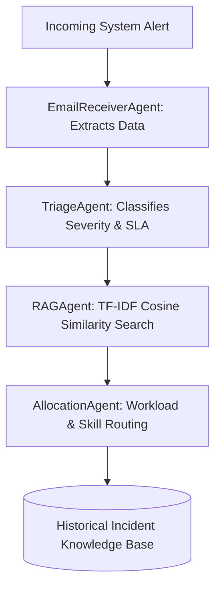

<div align="center">
  <h1>🚀 PulseOps AI: Autonomous Incident Response for SREs</h1>
  <p><strong>A Next-Generation Multi-Agent AIOps Platform Powered by Local LLMs & RAG</strong></p>

  [](https://opensource.org/licenses/MIT)
  [](https://www.python.org/)
  [](https://fastapi.tiangolo.com/)
  [](http://makeapullrequest.com)

  *Triage, allocate, and resolve incidents automatically using Local Language Models and Vector Search without compromising data privacy.*
</div>

---

## 📖 Overview

**PulseOps AI** is an open-source, multi-agent **Site Reliability Engineering (SRE)** orchestration tool designed to eliminate alert fatigue. By combining **Retrieval-Augmented Generation (RAG)** with autonomous agents, PulseOps AI automatically ingests unstructured server alerts, triages priority levels, searches historical knowledge bases for root cause analyses (RCA), and intelligently allocates tasks to the best-suited on-call engineer.

If you are struggling with high **Mean Time To Resolution (MTTR)**, manual runbook execution, or unoptimized on-call workload balancing, PulseOps AI provides an end-to-end automated pipeline out of the box.

### ✨ Key Features
* 🤖 **Multi-Agent Architecture**: Decoupled AI agents (Parser, Triage, RAG, Allocation) working seamlessly in a sequential pipeline.
* 🔒 **Local LLM Privacy**: Powered by **Ollama (`llama3.2`)**, ensuring your sensitive system logs and alerts never leave your internal network.
* ⚡ **Ultra-Fast Vector Search**: Custom in-memory **TF-IDF similarity engine** designed to match historical runbooks in <1ms without GPU overhead.
* ⚖️ **Intelligent Workload Routing**: Assigns critical tickets dynamically based on engineers' real-time workloads, specialties, and SLA risks.
* 💬 **Interactive RAG Copilot**: A built-in chat interface for SREs to run diagnostic queries against the active system state.
* 🎨 **Premium Cyberpunk Dashboard**: A luxurious, high-performance HTML/JS interface featuring a Matrix Emerald Green theme, glassmorphism, and instant tab routing.

---

## 🏗️ System Architecture

PulseOps AI follows a modular pipeline designed for high-availability IT operations:



### The AI Pipeline
1. **Parser Agent:** Converts unstructured raw alert emails into structured JSON metrics.
2. **Triage Agent:** Calculates priority SLA risk scores using deterministic matrices.
3. **RAG Agent:** Queries past resolutions using cosine similarity to recommend immediate fixes.
4. **Allocation Agent:** Identifies the optimal on-call engineer based on current capacity and tech stack familiarity.

---

## 💻 Technology Stack

* **Backend**: Python (3.9+), FastAPI, Uvicorn, Pydantic
* **AI & NLP**: Ollama (`llama3.2`), Custom TF-IDF Vectorization, Retrieval-Augmented Generation (RAG)
* **Frontend**: HTML5, Vanilla JavaScript (ES6+), Vanilla CSS3 (Custom Properties, Grid, Flexbox)
* **Design System**: Responsive Cyberpunk / CRED-inspired Dark Mode

---

## 🚀 Getting Started

Deploy PulseOps AI locally in just a few minutes.

### Prerequisites
* Python 3.9 or higher
* [Ollama](https://ollama.ai/) installed locally and running the `llama3.2` model (`ollama run llama3.2`).

### Installation

1. **Clone the repository:**
   ```bash
   git clone https://github.com/jayanthkumar10/PulseOps-.git
   cd PulseOps-
   ```

2. **Install Backend Dependencies:**
   ```bash
   pip install -r backend/requirements.txt
   ```

3. **Start the FastAPI Backend:**
   ```bash
   python -m uvicorn backend.main:app --host 127.0.0.1 --port 8000 --reload
   ```

4. **Serve the Frontend Dashboard:**
   Open a new terminal and start a static server:
   ```bash
   python -m http.server 8080
   ```

5. **Access the Application:**
   Open your browser and navigate to [http://localhost:8080](http://localhost:8080).

---

## 🤝 Contributing & Community
We welcome contributions from the community! Whether you want to add new LLM integrations, optimize the vector database, or enhance the dashboard UI, feel free to open a Pull Request.

**If you find this project useful, please leave a ⭐ Star! It helps the project grow and reach more developers.**

---

## 🛡️ License
Distributed under the MIT License. See `LICENSE` for more information.


