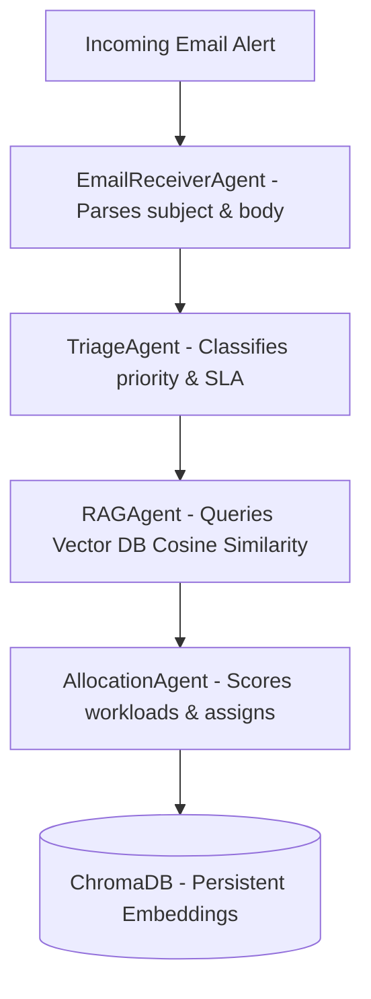

# PulseOps AI - System Architecture (Refactored)

This document details the agent pipeline and RAG database architectures.

---

## 1. Multi-Agent Email Intake Pipeline

### Agent Responsibilities
1. **EmailReceiverAgent (`email_agent.py`)**:
   - Takes unstructured mail strings.
   - Extracts subject line, body summary, sender, and categorizes category flags.
2. **TriageAgent (`triage_agent.py`)**:
   - Parses the text payload.
   - Evaluates impact/urgency vectors to generate the Priority Score.
   - Calculates target SLA duration bounds.
3. **RAGAgent (`rag_agent.py`)**:
   - Submits query query-text to the `ChromaDB` collection.
   - Pulls best similarity match with metadata pre-filtering, returning confidence ratings and RCA guides.
   - Indexes completed solutions.
4. **AllocationAgent (`allocation_agent.py`)**:
   - Scores operator profiles.
   - Assigns the ticket to the operator showing the highest score.

---

## 2. Working RAG Vector Database (`ChromaDB`)

To execute search matching with production-grade reliability, we use **ChromaDB** with a persistent client in `backend/database/store.py`.

### Features

1. **Persistent Client**: Stores embeddings persistently in SQLite across server restarts.
2. **Metadata Pre-filtering**: Uses `category` metadata to filter search results prior to calculating distance, improving speed.
3. **Guardrails**: Distance thresholds applied to reject hallucinations.

---

## 3. Vector Upserts & Editing

When an operator resolves a ticket:
1. The resolution text is posted to `/api/resolve`.
2. The RAG Ingestor calls `ChromaVectorDB.upsert(doc_id="kb-{ticket_id}", ...)` with the new solution.
3. If `doc_id` exists in the index, ChromaDB implicitly overwrites the previous embedding.
4. This ensures the system explicitly mutates knowledge rather than appending conflicting resolutions.
