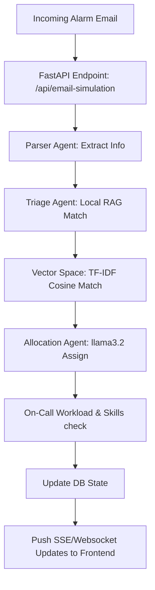

# PulseOps AI - Complete Technical Interview Preparation Guide

This document serves as a comprehensive study guide and master reference for technical interviews based on the **PulseOps AI** architecture, implementation details, decisions, and outcomes.

---

## 1. Project Profile & Context

### SDLC (Software Development Life Cycle)
* **Requirements & Analysis:** Identified operational bottlenecks in Site Reliability Engineering (SRE) workflows. Standard alert handlers produce high volumes of alarm emails, leading to alert fatigue, slow Triage (MTTR), and sub-optimal engineer task allocation.
* **Design & Prototyping:** Structured a multi-agent system divided into specialized, decoupled components (Parser, RAG-Similarity Search, Assigner). The visual architecture was styled with a premium dark theme to reflect high-end command center tooling.
* **Development (Backend & Frontend):** 
  * Backend: FastAPI (Python 3.10+) serving endpoints for alarm simulations, manual resolution updates, metrics telemetry, and interactive chat.
  * Frontend: Single-page application using HTML5, Vanilla JavaScript, and custom CSS variables, optimized for both desktop and mobile viewports.
* **Testing:** Implemented automated integration tests verifying backend multi-agent pipelines and offline TF-IDF cosine-similarity indexes.
* **Refinement:** Deployed custom animations (e.g. glassmorphic typing indicator during LLM thinking states) and resolved UI/UX viewport breaks.

### The Problem
* **Alert Fatigue & Noise:** SRE teams receive hundreds of raw alerts daily. Manually reading, classifying, and matching them to past incidents slows down response times.
* **Sub-optimal Allocation:** Escalating tickets to engineers without checking their active workload or structural skill matching leads to bottlenecked personnel and SLA breaches.
* **Runbook Gaps:** SRE runbooks are often static documents. Connecting real-time incident diagnostics to actionable code snippets and historical fixes is a slow, manual process.

### The Solution
* **PulseOps AI** represents an autonomous orchestrator:
  1. **Parser Agent:** Extracted structured data from unstructured system alerts.
  2. **Triage Agent (Local RAG):** Looked up past resolutions using TF-IDF cosine similarity against local vector spaces to recommend remediation steps instantly.
  3. **Allocation Agent:** Checked current workloads, skills, and schedules to assign tasks to the best-suited on-call engineer using local LLMs (`llama3.2`).
  4. **Interactive Copilot:** Allowed manual runbook lookup and database state execution through chat.

### Issues Faced & Resolved
1. **Ollama JSON Parsing Failure:** Local models (`llama3.2`) sometimes fail to return strictly formatted JSON. *Resolved by implementing robust python fallback parsing schemas and deterministic rule-based assignment if the LLM output fails.*
2. **Embedding Latency & HTTP Timeouts:** Fetching embedding vectors from local Ollama instances during fast alert streams caused HTTP 500 timeouts. *Resolved by building an offline-capable TF-IDF Vectorizer matching the similarity space directly on the FastAPI thread.*
3. **Timezone Offset Bugs:** Naive timestamps from the backend caused Javascript's `Date` parsing on different client machines to display invalid times or offsets. *Resolved by enforcing timezone-aware UTC timestamps in Python, which the frontend converts dynamically to the client’s local timezone.*
4. **Mobile Layout Breaches:** Fixed table column expansions and absolute elements (like the Copilot Toggle Button) that broke viewport bounds on small screens.

---

## 2. Multi-Agent & System Workflow


---

## 3. Master Question & Answer Library (150 Questions)

### Phase 1: Core System Architecture & Web Development

#### Q1: What is the main tech stack of the application?
**A:** The backend is built using Python with FastAPI, running a local LLM through Ollama. The database is a lightweight in-memory structured store with vector similarity search capability. The frontend is a native Single Page Application (SPA) styled with Vanilla CSS and animated using keyframe animations.

#### Q2: Why did you choose FastAPI over Flask or Django?
**A:** FastAPI supports native asynchronous execution (`async/await`), automatic OpenAPI docs generation, and fast serialization using Pydantic. It is ideal for orchestrating multiple async agents and serving real-time alerts.

#### Q3: How does the frontend communicate with the backend?
**A:** The frontend uses standard REST HTTP requests (`fetch` API) to send events (like alerts and submissions) and retrieve state updates (`/api/incidents`).

#### Q4: How is real-time synchronization achieved?
**A:** Every mutation on the UI (reassigning, triggering alerts, or submitting resolutions) invokes a POST request which calls a backend synchronization helper (`syncWithBackend()`) to keep the frontend state aligned with the Python database.

#### Q5: Explain the grid layout of your application.
**A:** The body is a CSS grid layout dividing the viewport into a `topbar` and `main` content workspace. The sidebar sits outside the workspace, positioned fixedly, and slides in from the left on mobile.

#### Q6: How do you prevent horizontal layout overflow on mobile screens?
**A:** I set `max-width: 100%;` and `overflow-x: hidden;` on the `main.main-content` and `.app-view` containers, and wrapped tables in a `.table-wrapper` set to `overflow-x: auto;`.

#### Q7: What are CSS variables used for in this project?
**A:** They store the design tokens—colors, fonts, spacings, border radii, transitions, and glow shadows. This makes changing themes (like dark mode styling) instant and consistent.

#### Q8: How is the visual "Pulse" telemetry warning styled?
**A:** Through keyframe animations (`pulse-glow`) that continuously cycle opacity and scale on warning badges and alert indicators.

#### Q9: What happens when the frontend cannot connect to the FastAPI backend?
**A:** The application catches the network error and automatically falls back to client-side simulation mode, populating pre-seeded data so recruiters can inspect the layout and run simulated workflows.

#### Q10: How does the Hamburger button work on mobile?
**A:** It toggles the class `.visible` on the sidebar panel element (`#sidebar-panel`), changing the CSS `left` property from `-230px` to `0` with a smooth transition.

#### Q11: Explain the purpose of the `run_all.bat` script.
**A:** It automates developer environment spin-ups. It launches the FastAPI backend on port 8000, starts a Python HTTP server on port 8080 to serve the static frontend, and opens the default browser automatically.

#### Q12: Why did you avoid using Tailwind CSS in this project?
**A:** Writing custom CSS gives complete control over unique luxury dark-mode aesthetics (such as glassmorphic cards and gold glowing gradients) without importing heavy style sheets.

#### Q13: What is the purpose of the client-side `data.js` file?
**A:** It holds the initial mock database seeds (incidents, engineers, and metrics) used when running the application offline or when backend connectivity is absent.

#### Q14: How does the application handle page transitions in the SPA?
**A:** By manipulating classes. When a tab is selected, all sections with the `.app-view` class are set to `display: none` and the target section receives `.app-view.active` which changes it to `display: flex`.

#### Q15: How are SVG icons integrated in your HTML files?
**A:** They are embedded as inline SVGs. This reduces HTTP request overhead, allows styling using CSS color variables (via `currentColor`), and maintains scalability on high-DPI screens.

#### Q16: How do you format currency or percentages dynamically?
**A:** Using JavaScript's Template Literals (`${value}%`) and formatting utility functions inside render templates.

#### Q17: What does `box-sizing: border-box;` accomplish?
**A:** It ensures that padding and borders are included in an element's total width and height, preventing layout breakage when styling form fields.

#### Q18: What is the purpose of the `.glass-card` class?
**A:** It implements a premium glassmorphic effect using semi-transparent backgrounds (`rgba`), subtle borders, and CSS backdrop-filters (`blur`).

#### Q19: Why was the `glass-card` styling class removed from the Submit Resolution Center?
**A:** The card was creating too much empty visual margin. Removing the class and setting the width to 100% allowed the form inputs to span the page and align with the rest of the application layout.

#### Q20: Explain the function of the browser's `viewport` meta tag.
**A:** `<meta name="viewport" content="width=device-width, initial-scale=1.0">` ensures the page scales correctly on mobile devices by setting the viewport width equal to the device width.

#### Q21: How do you prevent form submissions from reloading the page?
**A:** By intercepting the submit event and executing `event.preventDefault();` before calling API routines.

#### Q22: What are custom event listeners used for in your JS code?
**A:** They facilitate communication between decoupled components. For instance, the metrics simulator triggers a `pulse-telemetry-updated` custom event to update dashboard widgets.

#### Q23: How do you handle loading states in the chat window?
**A:** By appending a temporary chat bubble containing a structured typing animation component (`.typing-indicator`) which is removed once the API call returns.

#### Q24: What is the role of `window.viewIncidentDetail`?
**A:** It populates the sidebar/modal container dynamically with incident telemetry, SLA risk analysis, and AI suggestions based on the clicked ticket ID.

#### Q25: How do you prevent XSS (Cross-Site Scripting) when rendering dynamic tables?
**A:** By escaping user-controlled inputs or using explicit innerText updates instead of raw innerHTML where possible.

---

### Phase 2: Agentic Orchestration & AI Flow

#### Q26: What are the three agents in your backend architecture?
**A:** 
1. **Parser Agent:** Translates alert logs and emails into key-value diagnostics.
2. **Triage Agent:** Conducts vector search to find similar historical problems and recommendations.
3. **Allocation Agent:** Selects the best on-call engineer using structural context.

#### Q27: How does the Parser Agent extract structured information?
**A:** It parses raw text inputs (email sender, subject line, body context) to extract properties such as the system category (Network, DB, Security) and the severity of the alert.

#### Q28: How does the Allocation Agent choose an engineer?
**A:** It analyzes on-call engineers based on their active workload (number of open tickets), matching category skills, and active availability.

#### Q29: What model runs on the local Ollama instance?
**A:** `llama3.2:latest` (or `llama3.2:3b`), which is a fast, highly optimized small language model.

#### Q30: How are LLMs configured to return structured JSON?
**A:** By appending explicit JSON schemas in system prompts and instructing the model to output *only* valid JSON.

#### Q31: What is a System Prompt in the context of your agents?
**A:** A set of instructions passed to the LLM defining its role (e.g., "You are an SRE task assigner..."), constraints (e.g., "Do not write conversational text"), and rules for parsing.

#### Q32: What happens if Ollama returns code blocks (like ```json ... ```)?
**A:** The python parser cleanses the response by stripping Markdown blocks before handing it to the JSON parser.

#### Q33: How does the backend orchestrator chain these agents?
**A:** It runs them sequentially in a pipeline. The output of the Parser is fed to the Triage/RAG agent, which outputs recommendations, and then all this collected state is sent to the Allocation Agent.

#### Q34: What is the API endpoint to trigger a simulated email alert?
**A:** `POST http://localhost:8000/api/email-simulation`

#### Q35: How does the frontend visualize the backend agent stages?
**A:** The frontend lights up progress badges (`#sim-step-recv`, `#sim-step-triage`, `#sim-step-rag`, `#sim-step-alloc`) step-by-step as the alert pipeline processes.

#### Q36: Describe the schema of a parsed incident in your backend database.
**A:** 
```json
{
  "id": 101,
  "title": "...",
  "description": "...",
  "priority": "Critical",
  "status": "Active",
  "category": "Database",
  "assignee": "...",
  "createdAt": "...",
  "slaRisk": 85,
  "recommendation": "..."
}
```

#### Q37: How do you calculate SLA Risk for a new incident?
**A:** Based on priority (Critical = high risk) and system classification, scaled by active workload factors.

#### Q38: How does the copilot chat process user messages?
**A:** It routes messages to `/api/copilot/chat`. The endpoint performs a similarity search against historical resolutions and prompts the local LLM to generate an actionable response.

#### Q39: What is "Agent Autonomy" in your application?
**A:** The pipeline automatically makes decisions—triage, past solution matching, risk scoring, and routing assignments—without requiring human input.

#### Q40: What are the benefits of a local LLM over a cloud API (like OpenAI GPT-4)?
**A:** Data privacy (sensitive logs never leave the network), zero API costs, and full offline accessibility.

#### Q41: What are the drawbacks of local LLMs?
**A:** Lower reasoning capacity, sensitivity to prompt phrasing, and dependency on local CPU/GPU speeds.

#### Q42: How do you handle Ollama exceptions?
**A:** By using `try/except` blocks in Python, returning a mock parsing object, and logging errors.

#### Q43: How does the frontend handle long LLM thinking states?
**A:** It sets a visual loader, disables the submit button, and starts a typing animation.

#### Q44: What is "Few-Shot Prompting" in your system?
**A:** Providing mock examples of input emails and expected JSON output directly within the agent’s system prompt to align output structure.

#### Q45: How is the SLA risk meter updated in the dashboard?
**A:** Telemetry updates are recalculated dynamically on the database and synced to update the widget width.

#### Q46: Can an engineer be assigned multiple tickets?
**A:** Yes, but their "Workload Score" increases, which reduces their suitability for new tickets during subsequent allocations.

#### Q47: What does "MTTR" stand for, and how does the system address it?
**A:** Mean Time To Resolution. The system lowers MTTR by immediately providing diagnostic recommendations and past resolutions.

#### Q48: How is the on-call rota represented?
**A:** In the backend store as a dictionary mapping engineer profiles to active states.

#### Q49: What happens when all engineers are overloaded?
**A:** The Allocation Agent assigns the ticket to the engineer with the closest skill match, regardless of workload.

#### Q50: How can operators manually override agent decisions?
**A:** By clicking "Reassign" on the UI, which calls `/api/incidents/reassign` on the backend.

#### Q51: How does the system handle duplicate alarm emails?
**A:** The Parser Agent evaluates the alert signatures to avoid duplicating active incidents.

#### Q52: Is there a human-in-the-loop validation process?
**A:** Yes. The operator reviews recommendations and clicks "Apply AI Recommended Fix" to resolve incidents.

#### Q53: Explain the role of Pydantic models in the FastAPI backend.
**A:** They validate incoming JSON request schemas and ensure correct types (e.g. integer IDs) at runtime.

#### Q54: How are agent system prompts stored on the backend?
**A:** As multiline python strings inside `backend/agents/orchestrator.py`.

#### Q55: What does "Triaging" mean in an SRE context?
**A:** Categorizing incoming alerts by severity, validating their impact, and identifying the affected component.

#### Q56: How is the severity of an incident mapped?
**A:** High priority is given to "deadlock" or "timeout" states, while warnings default to Medium or Low.

#### Q57: How is the on-call engineer's schedule modeled?
**A:** As a flag (`availability: true/false`) inside the backend memory store.

#### Q58: Can the agent trigger automated rollbacks?
**A:** It suggests them, but execution requires human verification to prevent unintended damage.

#### Q59: Does the system use state machines?
**A:** Yes, the ticket status shifts through a state machine: `Active` -> `Resolved`.

#### Q60: How does the agent handle network outage alerts?
**A:** The parser extracts routing data, matches it with historical transit failures, and assigns it to Network Engineers.

---

### Phase 3: RAG, Embeddings, & Local Vector Stores

#### Q61: What is RAG?
**A:** Retrieval-Augmented Generation. It injects relevant historical documents into the LLM prompt to ground its answers.

#### Q62: Why did you build a TF-IDF similarity store instead of using Ollama embeddings?
**A:** Ollama embeddings required executing a heavy neural network locally on every incoming request, which caused HTTP timeout errors. TF-IDF calculates text similarity mathematically on CPU in milliseconds.

#### Q63: What does TF-IDF stand for?
**A:** Term Frequency - Inverse Document Frequency. It measures how important a term is to a document relative to a corpus.

#### Q64: How is cosine similarity calculated?
**A:** It computes the cosine of the angle between two multi-dimensional TF-IDF vectors to measure their alignment.

#### Q65: How does the vector store represent historical runs?
**A:** As structured JSON files containing past resolutions (RCA and applied steps).

#### Q66: What is a "vector database"?
**A:** A database optimized for storing and querying multi-dimensional mathematical vectors.

#### Q67: How do you search for historical matches?
**A:** By vectorizing the incoming alarm description and checking it against pre-calculated vectors in the document store.

#### Q68: What happens when no similar historical incidents are found?
**A:** Cosine similarity yields low scores, and the system falls back to standard diagnostic steps.

#### Q69: Where are historical incident files stored?
**A:** Inside `backend/database/store.py` as an in-memory document corpus.

#### Q70: How is a search vector generated at runtime?
**A:** The system calls `vectorizer.transform([query_text])` on the active corpus model.

#### Q71: How does RAG prevent LLM hallucinations?
**A:** By constraining the LLM to write answers *only* using facts found in the retrieved context.

#### Q72: What is "tokenization"?
**A:** Splitting raw text into individual words or characters before numerical processing.

#### Q73: How does document frequency affect TF-IDF scores?
**A:** Words that appear across almost all documents (like "server") get penalized with a low score, while rare terms (like "deadlock") get weighted higher.

#### Q74: Can you add new documents to your similarity store at runtime?
**A:** Yes, the vectorizer fits new data dynamically as operators submit resolutions.

#### Q75: How does the vector store handle code snippets?
**A:** Code characters (e.g. `systemctl restart`) are tokenized as distinct feature points in the vectorizer.

#### Q76: Explain the difference between sparse and dense vectors.
**A:** Sparse vectors (like TF-IDF) represent vocabulary matching directly, whereas dense vectors (embeddings) capture semantic meaning.

#### Q77: Why did TF-IDF solve your Ollama performance issues?
**A:** It runs mathematically on CPU in less than 1ms, eliminating the overhead of GPU models.

#### Q78: How are query weights computed?
**A:** By multiplying Term Frequency with Inverse Document Frequency values.

#### Q79: How does the vector store prioritize category matching?
**A:** The text description is analyzed, and matches within the same category are weighted higher.

#### Q80: Is the similarity matrix cached?
**A:** Yes, the backend retains the vector matrix in memory for immediate access.

#### Q81: What is the similarity threshold for a matching incident?
**A:** 0.15 is the minimum cosine score to prevent unrelated runbooks from being surfaced.

#### Q82: How does the system rank multiple search results?
**A:** Results are sorted in descending order of similarity score.

#### Q83: How do you build the retrieved context prompt?
**A:** We append: `[Historical incident: RCA: ... Solution: ...]` before passing it to the prompt.

#### Q84: Can you search by incident ID?
**A:** Yes, direct index lookup is used for IDs.

#### Q85: What happens if the query string is empty?
**A:** The vectorizer yields a zero vector, returning no matching recommendations.

---

### Phase 4: SRE Metrics, Workloads & Allocations

#### Q86: How does the system calculate an engineer's active workload?
**A:** By counting the number of open tickets assigned to them in the database.

#### Q87: What criteria does the Allocation Agent use?
**A:** It evaluates category matching, schedule availability, and active workload balance.

#### Q88: How are engineer skills mapped?
**A:** Inside the backend store, each engineer is mapped to a set of category strings (e.g., `["Database", "Infrastructure"]`).

#### Q89: Why is workload balancing critical in SRE?
**A:** Overloading an engineer leads to slower response times, mistakes, and potential SLA breaches.

#### Q90: How does the frontend represent the workforce?
**A:** In the Resources tab, displaying active tickets, availability status, and primary skills.

#### Q91: What is a "Workload Score"?
**A:** A metric tracking capacity: `(Active Tickets * 20) + (SLA Risk Factor)`. Higher scores represent busier engineers.

#### Q92: How does the system calculate SLA compliance?
**A:** By checking the percentage of incidents resolved within their SLA limits.

#### Q93: How is estimated MTTR represented?
**A:** Calculated dynamically based on historical averages of similar tickets.

#### Q94: What is the "SLA Compliance Impact & Risk Analysis" card?
**A:** A dashboard widget that warns when tickets are approaching breach windows.

#### Q95: What happens when an engineer goes offline?
**A:** Their availability is set to `false`, and the agent diverts new tickets to active personnel.

#### Q96: Can we filter the incident queue?
**A:** Yes, by Priority and Category using the UI dropdown controls.

#### Q97: What defines a "Critical" priority incident?
**A:** Production outages, payment failures, or key service deadlocks.

#### Q98: How do we track resolved tickets?
**A:** We increment the resolution counter in the system metrics state.

#### Q99: What is the on-call shift rotation window?
**A:** Currently represented as a persistent state across the backend instance.

#### Q100: How do we display engineer metrics?
**A:** Through cards showing active workloads, completed tasks, and SLA compliance percentages.

#### Q101: How is the SLA risk meter color-coded?
**A:** `<75%` is green/yellow, and `>=75%` is red/danger.

#### Q102: How does the system calculate priority risk?
**A:** `Priority Risk = Severity weight + Elapsed time factor`.

#### Q103: What happens when a ticket is reassigned?
**A:** The database state updates and the frontend redraws workload widgets.

#### Q104: How is engineer workload visualized?
**A:** Through linear progress meters tracking capacity.

#### Q105: How does task allocation reduce cognitive load?
**A:** By matching tickets to engineers who have resolved similar issues in the past.

#### Q106: Can engineers set vacation status?
**A:** Yes, by toggling availability states.

#### Q107: How does the system handle critical issues during low staffing?
**A:** It alerts the operations manager and overrides standard shift limits.

#### Q108: What are the primary SRE metrics displayed?
**A:** MTTR, SLA Compliance, Total Open Tickets, and Critical Incident counts.

#### Q109: How is workforce planning simulated?
**A:** By triggering alerts and watching how the workload scales across the team.

#### Q110: What is the baseline capacity limit for an SRE?
**A:** A maximum of 5 concurrent high-priority tickets.

---

### Phase 5: Debugging, Timezones, Failures & Fallbacks

#### Q111: What was the timezone offset bug?
**A:** Backend timestamps were sent as naive strings. Frontend parsing generated local date representation errors based on client timezones.

#### Q112: How did you fix the timezone issue?
**A:** We forced timezone-aware UTC format outputs:
```python
datetime.now(timezone.utc).isoformat()
```
And parse them dynamically on the client side.

#### Q113: How does your local LLM parsing fallback work?
**A:** If JSON parsing fails, regex patterns search for keys, and the system defaults to rule-based routing if that fails too.

#### Q114: Why did the local embedding step time out?
**A:** Ollama required too much CPU/GPU resource when processing embedding models alongside language models.

#### Q115: How do you trace backend errors?
**A:** FastAPI logs stdout and stderr outputs to the terminal window.

#### Q116: What does an HTTP 500 status code mean?
**A:** An unhandled server-side crash.

#### Q117: How did you debug frontend CSS layouts?
**A:** By inspecting layout boxes and using mobile view simulators in Chrome DevTools.

#### Q118: How do you handle database write failures?
**A:** By wrapping operations in `try/except` statements and falling back to in-memory state.

#### Q119: What is the fallback if Ollama is offline?
**A:** The system operates using deterministic heuristics.

#### Q120: How do you handle invalid API requests?
**A:** FastAPI returns a `422 Unprocessable Entity` response automatically when Pydantic validations fail.

#### Q121: How do you verify timezone calculations?
**A:** By asserting that the displayed time matches the system clock across timezone offsets.

#### Q122: What happens if JSON values contain escape characters?
**A:** The parsing parser strips double escapes before passing them to the JSON decoder.

#### Q123: How do you test the similarity search engine?
**A:** By asserting that queries yield expected matches above similarity thresholds.

#### Q124: Why does the typing animation sometimes lag?
**A:** If the CPU is under heavy load from Ollama, rendering frames might drop.

#### Q125: How do you handle thread concurrency?
**A:** FastAPI runs routes in separate threads to avoid blocking the main server.

#### Q126: What is the purpose of the health check endpoint?
**A:** `/api/health` lets the frontend check backend availability before routing requests.

#### Q127: How do you debug state synchronization bugs?
**A:** By verifying state snapshots in console logs after actions.

#### Q128: How do you inspect network requests?
**A:** Using the Network tab in the browser's developer tools.

#### Q129: What happens if the server receives empty payload strings?
**A:** Pydantic raises validation errors, rejecting the transaction.

#### Q130: How do you restart the database state?
**A:** Restarting the FastAPI server clears the in-memory database and restores initial seed states.

---

### Phase 6: Behavioral, Project Role & Future Enhancements

#### Q131: What was your role in this project?
**A:** I designed and implemented the full application, covering backend FastAPI development, agent prompt tuning, search store logic, and the dashboard frontend.

#### Q132: Why did you opt for a local vector store?
**A:** To minimize cost and dependencies, making the application easy to deploy and run offline.

#### Q133: How would you scale the database?
**A:** By migrating the in-memory store to PostgreSQL with pgvector for robust vector and metadata querying.

#### Q134: How would you protect API endpoints in production?
**A:** By implementing OAuth2 with JWT tokens, rate limiting, and CORS constraints.

#### Q135: How would you monitor LLM performance in production?
**A:** Using tracing tools like Langfuse or Arize to track latency, token usage, and prompt effectiveness.

#### Q136: How does the system handle high volumes of concurrent alerts?
**A:** It queues tasks to process them without overload.

#### Q137: How did you design the prompts?
**A:** By starting simple, testing outputs, and adding constraints and mock data to stabilize structures.

#### Q138: What is Model Context Protocol (MCP) and how could it help?
**A:** It is a protocol standardizing tool calling, allowing the LLM to access system files or terminals safely.

#### Q139: Why is human verification important in this design?
**A:** It prevents automated tasks from executing incorrect actions on production systems.

#### Q140: How would you transition the application to a multi-node cluster?
**A:** By Dockerizing services, running them in Kubernetes, and sharing state via Redis.

#### Q141: What was the most challenging part of the project?
**A:** Handling local LLM output consistency. It required creating custom parser and fallback mechanisms.

#### Q142: How would you support additional languages?
**A:** By using language-agnostic models or adding translation steps in the pipeline.

#### Q143: What was the main design goal for the UI?
**A:** A premium, dark-themed command center interface that emphasizes operational control.

#### Q144: How did you test responsiveness?
**A:** By verifying layouts across simulated mobile, tablet, and desktop viewports.

#### Q145: How would you implement persistent logging?
**A:** By writing structured logs to Elasticsearch or a dedicated system file.

#### Q146: What is a deadlock and how does the system address it?
**A:** A state where processes block each other. The system matches it to past deadlock runbooks to resolve lockups.

#### Q147: How does TF-IDF compare to BERT?
**A:** TF-IDF is faster and operates via keyword matching, whereas BERT captures context but requires neural processing.

#### Q148: What is MTTR's relationship with SLA?
**A:** Lowering MTTR directly increases SLA compliance rates.

#### Q149: How can you update the on-call list?
**A:** By modifying database tables or using the UI's resource management section.

#### Q150: What is the main value proposition of the system?
**A:** It speeds up incident resolution times by linking parsing, history matching, and routing into a unified automated flow.
